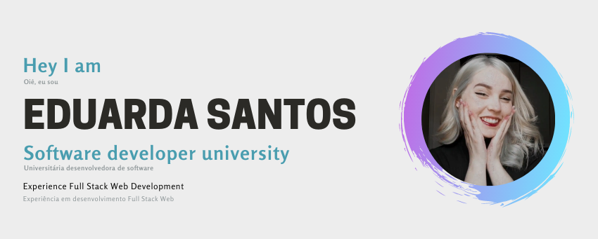

### Everything above? eduarda here (Tudo em cima? eduarda aqui) 👋

---

  

I am a full-stack web developer who is still in development, looking to learn and turn coffee into code😉
(Eu sou um desenvolvedor web full-stack que ainda está em desenvolvimento, buscando aprender e transforma café em código😉)

### How to reach me: (Como entrar em contato comigo) <strong>(Click the badge to view my profiles !)</strong>

       

### Known Tools and Technologies (Ferramentas e tecnologias conhecidas)

                      

### Languages I want to learn (Linguagens que quero aprender)

  

